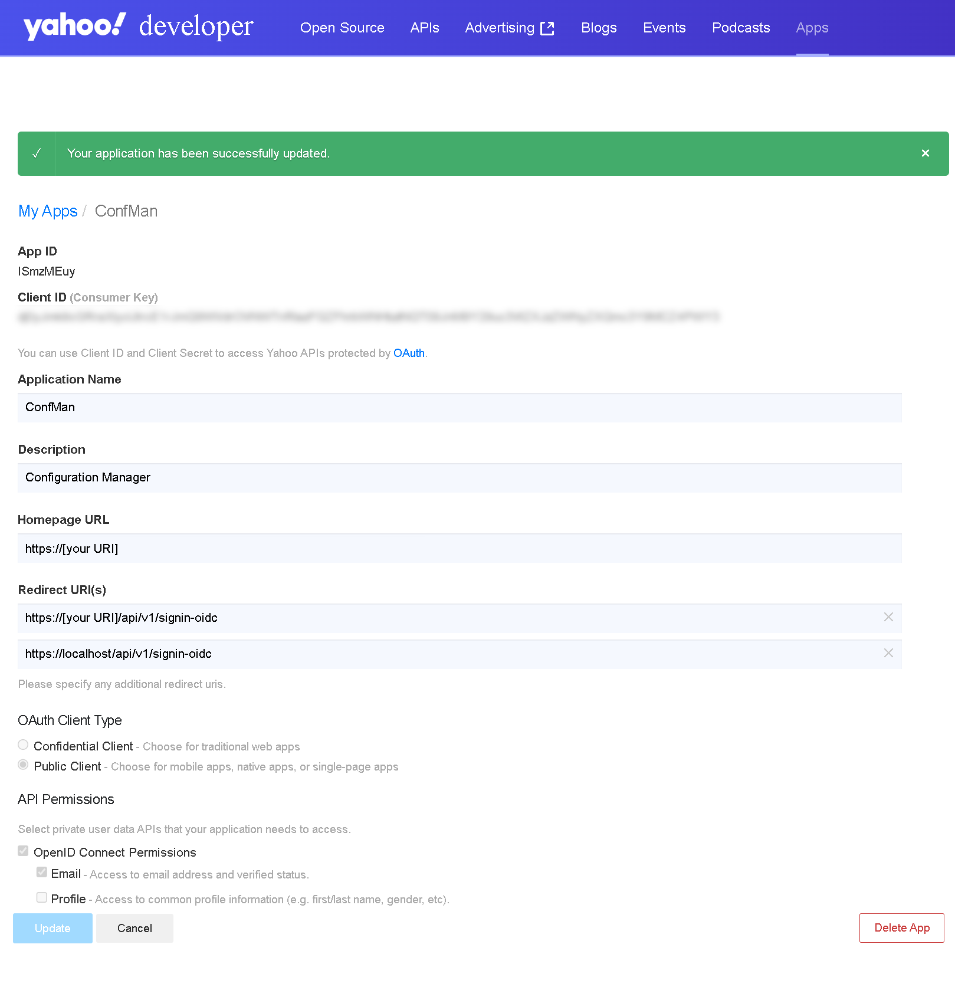

# Abeeway configuration manager

Abeeway configuration manager is a tool that allow users to define devices
configuration and to garantee that these configurations will be kept in place
during all the device's life.

This ropository explains how to it works, how to deploy and how to import
pre-defined settings. The docker image can be found on
[dockerhub](https://hub.docker.com/r/abeeway/configuration_manager).

## How does it work ?

### Parameter sets / Firmwares / default configurations

This is the central part of the tool. A parameter set is a description
of all parameters that can be configured in a specific device. It contains a
list of physical parameters, which are parameters that the device use, and a
list of logical parameters, which are parameters that a user want to manipulate.

Firmwares are a list of specific versions of devices. From a firmware version
to another, parameter sets could evolve as well as default configuration. That's
the reason why firmaware is a unique combination of hardware / parameter set /
default configuration for a specific code revision.

For pre defined Parameter sets / hardwares / firmwares / default configurations,
please jump to setup section.

### Configurations

For a given parameter_set, user can define a configuration. This configuration
can be based on a previous version, or from scratch. It is recommanded to
inherit a new configuration from a previous one (ideally from default
configuration). Once defined, it will be made available to devices once locked.

### Devices and device states

Devices contains the list of device that the user want to manage with confman.
For this to work, the tool maintain an internal state of the device, called
device state. If device state can totally be ignored by user, it is usefull
to verify that the device is operated with the right configuration.

### Link between devices and configurations

The link between devices and configurations is made thru tags:

* if a device has no tags, its configuration won't be managed by the tool ;
* if a device has tags defined but that no corresponding configuration exists
with the same tag, its configuration won't be managed by the tool ;
* if a device has tags defined, and a corresponding configuration has be
identified, its configuration will be managed by the tool.

Tags could be whatever you want. One example could be mission profile :

* nominal_tracking : could characterize missions concerning tracking operation
when no problem is encountered ;
* speedup_tracking : this mission could be set on configurations that would
stress device communication, in case of theft, for example ;
* stock : this mission could be used when the device has no tracking mission,
and is in stock.

*Why use tags instead of setting the configuration directly on the device ?*

The mission profile could be set, whatever the version of device is. even if the
hardware is different, or the firmware version is different, mission profile
could be applied to a device. Using tags allow to connect a configuration and
a device without having to go under the hood for choosing the right
configuration based upon the device firmware and hardware.

## Deploy

This tool rely on docker. You'll find to different configuration file :

* docker-compose.yaml ;
* k8s.yaml.

### Docker-compose

With the view to test our tool, the minimum configuration could be defined like
this : [docker-compose.yaml](deploy/generic/docker-compose.yaml).

You'll be able to navigate to [https://localhost](https://localhost).

Beware that this configuration will be security less, and exists only for
evaluation purposes. There is no certificate resolver, for example.

### Kubernetes

You'll find an example of kubernetes deployment file in an environment relying
on [Traefik](https://traefik.io) and [Let's encrypt](https://letsencrypt.org)
at the following url : [kubernetes-manifest.yaml](deploy/generic/kubernetes-manifest.yaml).

## Environment variables

### Database

This tool works with a database for storage. It could be a Sqlite or MySQL
database:

* `RDB__PROVIDERNAME`: MUST be either `mysql` or `sqlite` ;
* `RDB__CONNECTIONSTRING`: depending upon database type, this contains different
informations. Please refer to MySQL or Sqlite documentations. this is 2 examples
:

  * *MySQL*: `"Server=mywonderfull.serv.er; Port=3306; Database=configuration_manager; Uid=abeeway.api.confmgr.v1; Pwd='{pwd}';"` ;
  * *Sqlite*: `"Data Source=c:\Temp\ConfMan.db;"`.

* `RDB__PWD`: if needed, you can store the database user password in a seperate
variable that will replace `{pwd}` in the connection string.

### Users

Users are identified using OpenID infrastructure. To do so, the tool needs an
OpenID authorithy. To define one, you've got to specify following variables :

* `IDENTITY__AUTHORITY`: this is the url of the authority that is used for
identification ;
* `IDENTITY__METADATA-ADDRESS`: the url of the endpoint giving access to all
OpenID metadata. Usually, it ends with `/.well-known/openid-configuration` ;
* `IDENTITY__CLIENT-ID`: this is the name of the public client (no secret
supported, for the moment) ;
* `IDENTITY__ADMIN-EMAIL`: this is the email of the first user, that will be
the administrator of the tool.

#### Yahoo OpenID Connect Provider

If you don't have an OpenID architecture, you can use one of the following :
[OpenID Connect providers](https://connect2id.com/products/nimbus-oauth-openid-connect-sdk/openid-connect-providers)
If you wan't to use a very simple yet powerfull OpenID  Connect Provider, we
suggest using Yahoo. In this case, the settings are the following :

* `IDENTITY__AUTHORITY`: `https://api.login.yahoo.com` ;
* `IDENTITY__METADATA-ADDRESS`: `https://login.yahoo.com/.well-known/openid-configuration` ;
* `IDENTITY__CLIENT-ID`: this information can be retreive on the Yahoo API
portal.

To obtain the client-id, you'll have to register on Yahoo portal, then follow
this [Yahoo API tutorial](https://developer.yahoo.com/oauth2/guide/flows_authcode/).



Be adviced that registering localhost applications such https://localhost:7165
on the Yahoo portal is for test purpose only. notice also that you MUST modify
[your URI] by the public address allowing to access the application.

### API-Key

The API can also be used thru an API-Key. This is set using the following
variable :

* `AUTHENTICATION__APIKEY` : if specified, the API-Key will allow any consumer
to connect to the API and to retreive / modify data. the API key gives all
right to user.

A good exemple of strong API Key could be a string generated using openssl :

```bash
openssl rand --hex64 36
```

### HTTPS certificate for locahost

*Remark: This step is not mandatory.*

If you want a self signed certificate for your test environment in docker
compose, you'll have to use a specific 
[docker-compose.yaml](deploy/local_ca_https/docker-compose.yaml) file, once
you'll have generated self-signed certificate using the mkcert tool. Here are
the steps:

* download mkcert tool ;
* go to the folder containing `docker-compose.yaml` file ;
* go to certs folder ;
* execute
`mkcert -cert-file local-cert.pem -key-file local-key.pem "localhost"`.
* execute `mkcert -install`: it will install a local certificate authority
which will certify generated certificates.

Once back in the parent folder and docker compose launched, the
[localhost](https://localhost) will be trusted.

### LNS related variables

* `LNS__UPLINK_FILTER_PORT`: define the FPort used to filter uplinks received
from the LNS. If not specified, default value is 19 ;
* `LNS__DOWNLINK_PORT`: define the downlink FPort used to send downlinks to
devices. If not specified, default value is 3 ;
* `LNS__ACTILITY__OPERATOR_HOSTNAME`: if specified, the configuration manager
will be able to receive data from the specified Actility LNS ;
* `LNS__ACTILITY__APIKEY`: if specified, LNS will have to use the X-API-Key
header with the given value to be able to post successfully its data to this
configuration manager ;
* `LNS__ACTILITY__AS_ID` and `LNS__ACTILITY__AS_AUTHKEY`: if both specified,
they will be used in downlink requests. It will be used to cypher /
decypher data in the tunnel interface.

### Logs

The API logs every information on the console. If you want, you can log data
to Loki using the following environment variables :

* `LOKI__URI`: URI of the LOKI server ;
* `LOKI__LOGIN`
* `LOKI__PASSWORD`
* `LOKI__ENABLEREQUESTRESPONSELOGGINGON4XXAND5XX`: boolean value (true or false)
defaulted to false. When true, 400 and 500 HTTP Error are logged with full
context.

## Setup

Once deployed, the tool will have to be setup. To help customer in this step,
we make available setup files in the [setup repository](setup/).
You should download the last avalaible setup file, and use the configuration
management tool to import it. A few second later, all hardware / firmware /
parameter_sets / default configurations will be loaded in your database so that
you will be able to define your own configuration and apply them to any device.

## Limits

Configuration manager is under active development. For that reason, this service
has following limitations :

* if uplink/downlink security is activated, uplink security token won't be
checked ;

## Glossary

* _parameter_set_ : this is the starting point of this tool. A _parameter_set_ 
is the entity that allow us to define all parameters, and maximum and minimum
values ;
* _firmware_ : a release of our AT3 source code built for a specific hardware
and for which a _parameter_set_ and a default _configuration_ will be defined ;
* _physical_parameter_ : definition of a parameter for a specified 
_parameter_set_. Concretely, this is a parameter, as defined in the AT3 spec, 
with its identifier (`P0305` for example) ;
* _logical_parameter_ : this is a parameter that is defined upon a 
_physical_parameter_. It exists when a _physical_parameter_ is defined as a
enumeration and / or a bitfield ;
* _configuration_ : this is a collection of parameter values for a specific
_parameter_set_ ;
* _device_ : a device, identified by its _eui_ ;
* _running_configuration_ : the configuration that is actually ran in the
device ;
* _default_configuration_ : the configuration that is supposed to run in the
device when it has just been produced or when it has been reset ;
* _current_configuration_ : the configuration that is supposed to run in the
device. This is a backend data ;
* _target_configuration_ : the configuration that the user want to send to the
device. This configuration is infered by using tags defined both at device and
configuration levels ;
* _transient_configuration_ : the configuration that the tool will generate
to move from a given configuration toward the target configuration in one or
more steps.
